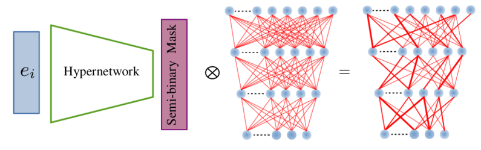

# HyperMask: Adaptive Hypernetwork-based Masks for Continual Learning

Generate a semi-binary mask for a target network using a hypernetwork.



Use <code>environment.yml</code> file to create a conda environment with necessary libraries. One of the most essential packages is [hypnettorch](https://github.com/chrhenning/hypnettorch) which should easy create hypernetworks in [PyTorch](https://pytorch.org/).

## DATASETS

The implemented experiments uses four publicly available datasets for continual learning tasks: Permuted MNIST, Split MNIST, Split CIFAR-100 and Tiny ImageNet. The datasets may be downloaded when the algorithm runs.

## USAGE

The description of HyperMask is included in the [paper](https://arxiv.org/abs/2310.00113). To perform experiments with the use of the best hyperparameters found and reproduce the results from the publication for five different seed values, one should run <code>main.py</code> file with the variable <code>create_grid_search</code> set to <code>False</code> and the variable <code>dataset</code> set to <code>PermutedMNIST</code>, <code>SplitMNIST</code>, <code>CIFAR100</code> or <code>TinyImageNet</code>. In the third and fourth cases, as a target network <code>ResNet-20</code> or <code>ZenkeNet</code> can be selected. To train ResNets, it is necessary to set <code>part = 0</code>, while to prepare ZenkeNets, one has to set <code>part = 1</code>. In the remaining cases, the variable <code>part</code> is insignificant.

Also, to prepare experiments with <code>CIFAR100</code> according to the FeCAM scenario, one should set the variable <code>dataset</code> in <code>main.py</code> to <code>CIFAR100_FeCAM_setup</code> with <code>part = 6</code> to run training with a ResNet model or <code>part = 7</code> to train a ZenkeNet model.

One can also easily perform hyperparameter optimization using a grid search technique. For this purpose, one should set the variable <code>create_grid_search</code> to <code>True</code> in <code>main.py</code> file and modify lists with hyperparameters for the selected dataset in <code>datasets.py</code> file.

## CITATION

If you use this library in your research project, please cite the following paper:

```
@misc{książek2023hypermask,  
     title={HyperMask: Adaptive Hypernetwork-based Masks for Continual Learning},  
     author={Kamil Książek and Przemysław Spurek},  
     year={2023},  
     eprint={2310.00113},  
     archivePrefix={arXiv},  
     primaryClass={cs.LG}  
}
```

## LICENSE

Copyright 2023 Institute of Theoretical and Applied Informatics, Polish Academy of Sciences (ITAI PAS) <https://www.iitis.pl> and Group of Machine Learning Research (GMUM), Faculty of Mathematics and Computer Science of Jagiellonian University <https://gmum.net/>.

Authors:<ul>
    <li> Kamil Książek (ITAI PAS, ORCID ID: 0000−0002−0201−6220),
    <li> Przemysław Spurek (Jagiellonian University, ORCID ID: 0000-0003-0097-5521).
</ul>

This program is free software: you can redistribute it and/or modify it under the terms of the GNU General Public License as published by the Free Software Foundation, either version 3 of the License, or (at your option) any later version.

This program is distributed in the hope that it will be useful, but WITHOUT ANY WARRANTY; without even the implied warranty of MERCHANTABILITY or FITNESS FOR A PARTICULAR PURPOSE. See the GNU General Public License for more details.

You should have received a copy of the GNU General Public License along with this program. If not, see <https://www.gnu.org/licenses/>.

The HyperMask repository includes parts of the code that come or are based on external sources: [hypnettorch](https://github.com/chrhenning/hypnettorch/tree/master), [FeCAM](https://github.com/dipamgoswami/FeCAM/blob/main/FeCAM_vit_cifar100.py), [Tiny ImageNet preprocessing 1](https://github.com/DennisHanyuanXu/Tiny-ImageNet/blob/master/src/data_prep.py) and [Tiny ImageNet preprocessing 2](https://github.com/pytorch/vision/issues/6127#issuecomment-1555049003).
